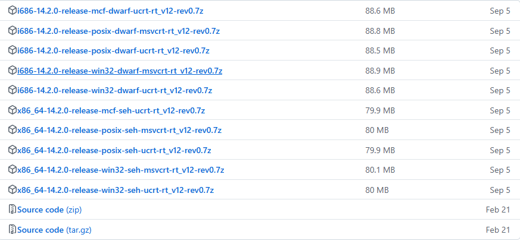
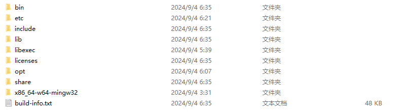
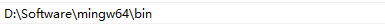
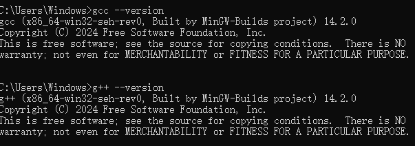
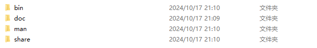
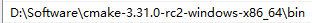
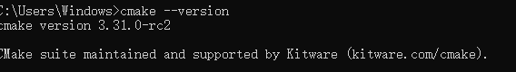
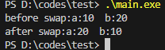
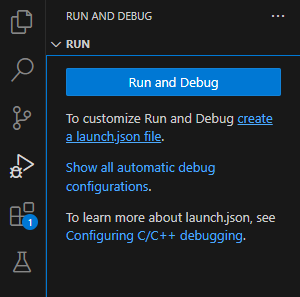

# Windows minGW

### 1 安装minGW

* 下载minGW：[Releases · niXman/mingw-builds-binaries](https://github.com/niXman/mingw-builds-binaries/releases)

  可以看到minGW存在非常多的版本，可以参考[【软件教程】MingW-W64-builds不同版本之间的区别_msvcrt与ucrt的区别-CSDN博客](https://blog.csdn.net/zhangjiuding/article/details/129556458) 选择需要的版本

  ​​
* 解压下载的压缩包

  ​​
* 注册环境变量

  ​​
* 验证环境

  ​​

### 2 安装cmake

* 下载cmake：https://cmake.org/download/
* 解压下载的压缩包

  ​​
* 注册环境变量

  ​​
* 验证环境

  ​​

### 3 vs code插件安装

* C.C++
* cmake
* cmake tools

### 4 代码实操

* mian.cpp

  ```undefined
  #include <iostream>

  using namespace std;

  // 实现两数交换
  void swap(int &a,int &b){
      int temp;
      temp = a;
      a = b;
      b = temp;
  }

  int main(){

      int a = 10;
      int b = 20;

      cout<<"before swap:"<<"a:"<<a<<"  "<<"b:"<<b<<endl;
      swap(a,b);
      cout<<"after swap:"<<"a:"<<a<<"  "<<"b:"<<b<<endl;

      return 0;

  }
  ```
* g++编译运行

  ```undefined
  g++ .\main.cpp -o main.exe
  ./main.exe
  ```

  ​​
* 调试代码

  创建launch.json文件

  ​​

‍
