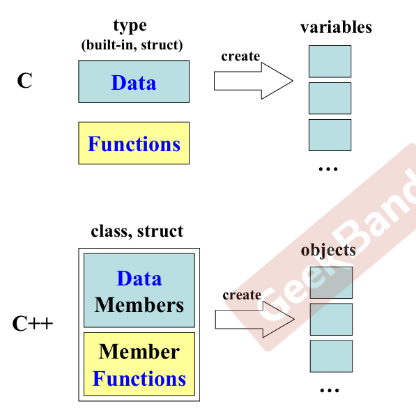
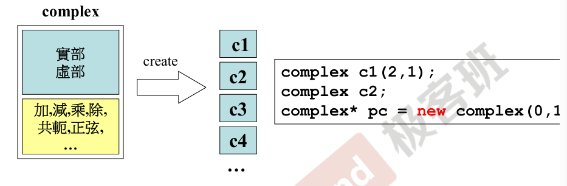
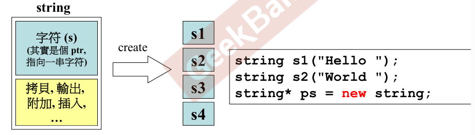
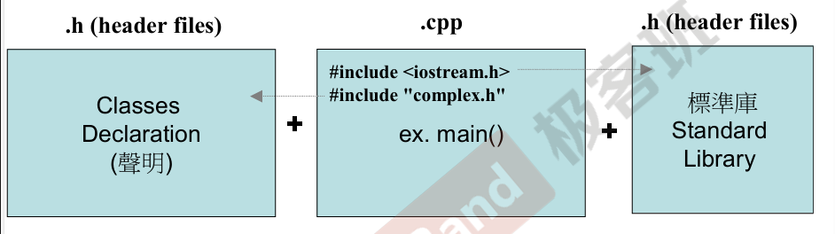
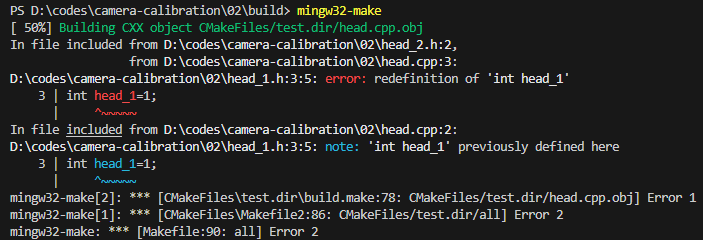

# 01-头文件与类的声明

### 1 面向过程 vs 面向对象

​​

### 2 两种类

##### 1 without ptr

​​

##### 2 with ptr

	注意：创建的四个对象大小均为一个字节，因为创建的对象都是指针，指向一块内存空间，而这块内存空间中才存放着需要的东西

​​

###### 3 两个概念

* 基于对象

  通常基于对象是使用对象，但是无法利用现有的对象模板产生新的对象类型，继而产生新的对象，也就是说基于对象**没有继承的特点**。而多态表示为父类类型的子类对象实例，没有了继承的概念也就无从谈论多态。

  现在的很多流行技术都是基于对象的，使用一些封装好的对象，调用对象的方法，设置对象的属性。但是派生新对象类型，只能使用现有对象的方法和属性。
* 面向对象

  封装，继承，多态（缺一不可）

  判断一个新的技术是否是面向对象的时候，通常可以使用后两个特性来加以判断。面向对象和基于对象**都实现了封装的概念**，但是面向对象实现了继承和多态，而基于对象没有实现这些。

  简单地说：**基于对象不能继承，更谈不上多态。**

### 3 C++代码形式

​​

注意两个点：

* 自定义头文件引号调用
* 头文件的防卫式声明

  以下代码，在head_2.h中引用了head_1.h，同时也在head.cpp中引用了head_1.h，那么在编译时就会出现如下的错误：

  ​​

  ```undefined

  int head_1=1;

  ############

  #include "head_1.h"

  int head_2=2;

  ############
  #include <iostream>
  #include "head_1.h"
  #include "head_2.h"

  int main(){
      std::cout<<head_1<<std::endl;
      std::cout<<head_2<<std::endl;
  }
  ```

  在头文件中采用防卫式的声明，避免出现重复定义的错误

  ```undefined
  #ifndef __HEAD_1__
  #define __HEAD_1__

  int head_1=1;

  #endif
  ############
  #ifndef __HEAD_2__
  #define __HEAD_2__

  #include "head_1.h"

  int head_2=2;

  #endif
  ############
  #include <iostream>
  #include "head_1.h"
  #include "head_2.h"

  int main(){
      std::cout<<head_1<<std::endl;
      std::cout<<head_2<<std::endl;
  }
  ```

  在预编译阶段，编译器会把头文件展开，即head.cpp中的代码可以看做是：

  ```undefined

  int head_1=1;

  int head_1=1;
  int head_2=2;

  int main(){
      std::cout<<head_1<<std::endl;
      std::cout<<head_2<<std::endl;
  }
  ```

  参考：[[C++]关于头文件中的防卫式声明 - swefii - 博客园](https://www.cnblogs.com/swefii/p/10505674.html)

### 4 类的声明
