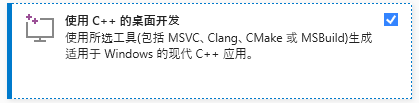
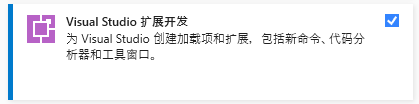
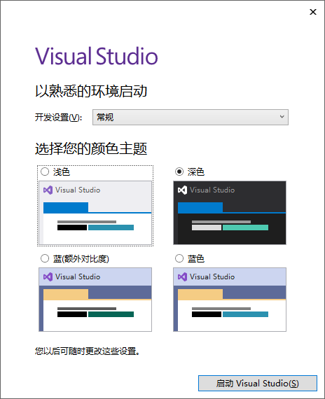
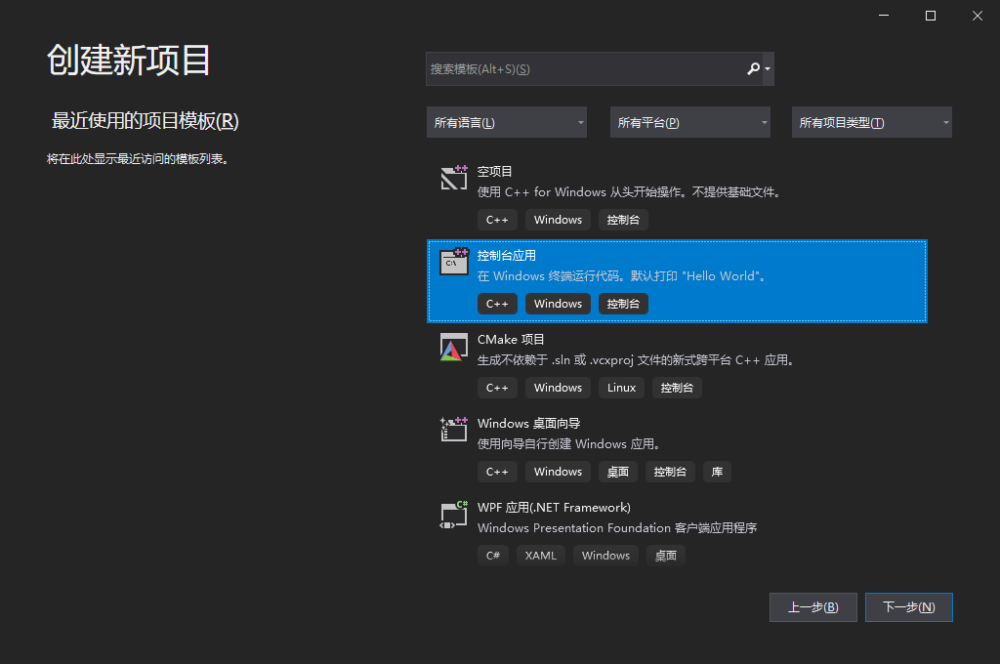
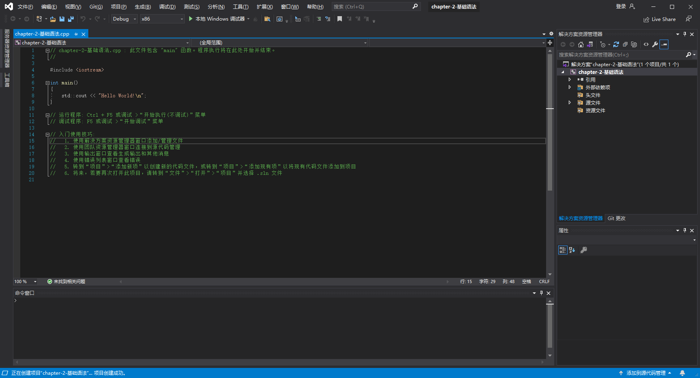
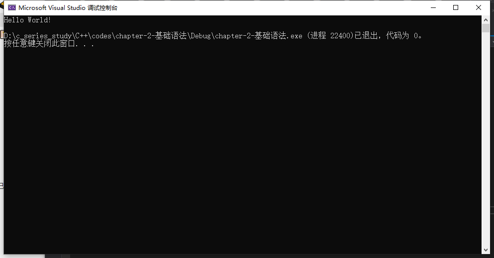

# 1-开发环境的安装与使用

* 下载地址：

  * [https://pan.baidu.com/s/1VfPni3gWabjIMH1oaBEd6Q](https://pan.baidu.com/s/1VfPni3gWabjIMH1oaBEd6Q)（提取码：gtmw）
  * [MSDN, 我告诉你 - 做一个安静的工具站 (itellyou.cn)](https://msdn.itellyou.cn/)（2017及之前版本）
  * [Downloads &amp; Keys - Visual Studio Subscriptions](https://my.visualstudio.com/Downloads?q=visual%20studio%202019&wt.mc_id=o~msft~vscom~older-downloads)（官网提供的链接不可用）
* 安装：

  选择以下两个选项（根据需求）：

  ​​

  ​​
* 启动：

  * 选择主题：

    ​​
  * 创建项目

    ​​
  * 运行项目

    ​​
  * 经典的Hello World！

    ​​
