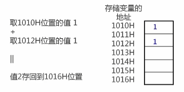
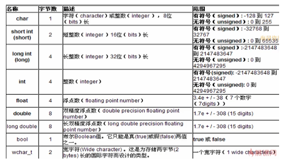

# 3-数据类型

* 简单例子

  ```c++
  #include <iostream>

  int main() {
  	// 定义变量
  	int sum;
  	// 定义变量并赋值
  	int num1 = 0;
  	int num2 = 0;
  	// 赋值
  	sum = num1 + num2;
  	std::cout << "sum:" << sum << std::endl;

  	return 0;
  }
  ```
* 数据类型内部结构

  C++每个变量都有对应数据类型（强类型语言），数据类型决定变量所占的内存空间大小以及布局方式、存储值的范围以积极能参与的运算

  ​​
* 数据类型

  ​​

  ```c++
  #include <iostream>

  int main() {
  	char a[10] = "a";
  	short int b = 10;
  	int c = 10;
  	long int d = 10;
  	float e = 10.0;
  	double f = 10.0;
  	long double g = 10.0;
  	bool h = false;
  	wchar_t i[10] = L"a";

  	return 0;
  }
  ```
