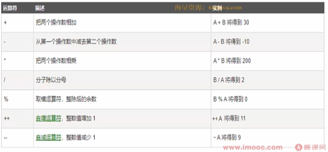
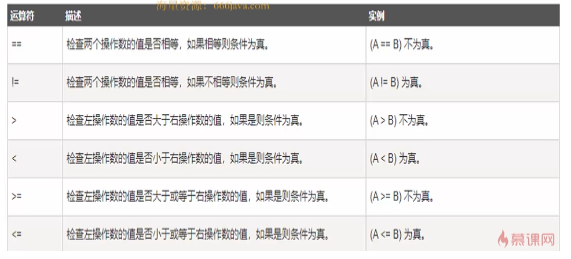
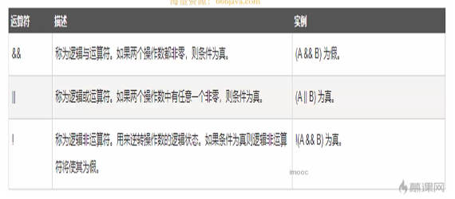
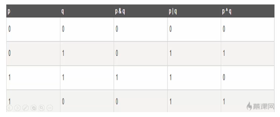
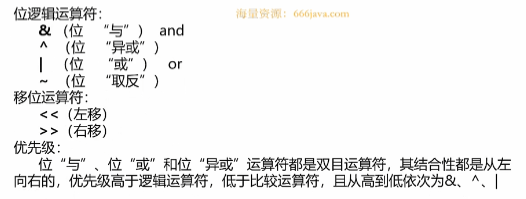
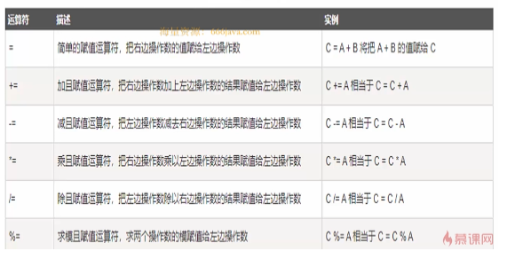
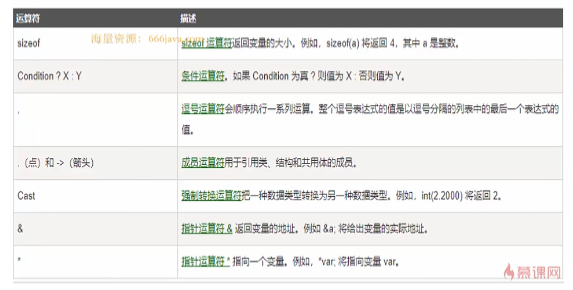

# 1-运算符与表达式

* 运算符

  运算符是告诉编译器执行特定的数学或逻辑操作的符号

  * 算术运算符

    ​​

    ```c++
    #include <iostream>

    int main()
    {
        int a = 10;
        int b = 20;

        std::cout << "a+b:" << a + b << std::endl;
        std::cout << "a-b:" << a - b << std::endl;
        std::cout << "a*b:" << a * b << std::endl;
        std::cout << "a/b:" << a/ b << std::endl;
        std::cout << "a%b:" << a % b << std::endl;
        // 注意一下自增运算符在前在后的区别
        std::cout << "a++:" << a++ << std::endl;
        std::cout << "++a:" << ++a << std::endl;
        std::cout << "a--:" << a-- << std::endl;
        std::cout << "--a:" << --a << std::endl;
      
    	return 0;
    }

    ```
  * 关系运算符

    ​​
  * ```c++
    #include <iostream>

    int main()
    {
        int a = 10;
        int b = 20;

        std::cout << "a==b:" << (a==b) << std::endl;
        std::cout << "a!=b:" << (a!=b) << std::endl;
        std::cout << "a>b:" << (a>b) << std::endl;
        std::cout << "a<b:" << (a<b) << std::endl;
        std::cout << "a>=b:" << (a>=b) << std::endl;
        std::cout << "a<=b:" << (a<=b) << std::endl;

        return 0;
    }


    ```
  * 逻辑运算符

    ​​

    ```c++
    #include <iostream>

    int main()
    {
        int a = 10;
        int b = 20;

        std::cout << "德摩根定律:" << (!(a||b)==(!a&&!b)) << std::endl;

        return 0;
    }


    ```
  * 位运算符

    转换为二进制进行运算

    ​​

    ​​

    ```c++
    #include <iostream>
    #include <bitset>

    int main()
    {
        int a = 10;
        int b = 20;

        std::cout << "&:" << (a&b) << std::endl;
        std::cout << "|:" << (a|b) << std::endl;
        std::cout << "^:" << (a^b) << std::endl;
        std::cout << "<<:" << (a<<2) << std::endl;
        std::cout << ">>:" << (a>>2) << std::endl;
        // 涉及原码 反码 补码
        std::cout << "~:" << ~a << std::endl;
        std::cout << (std::bitset<10>)a << std::endl;
        std::cout << std::dec << a << std::endl;
        std::cout << (std::bitset<10>)~a << std::endl;
        std::cout << std::dec << ~a << std::endl;

        return 0;
    }


    ```
  * 赋值运算符

    ​​
  * 杂项

    ​​
* 表达式

  运算符将操作数连接起来的式子
