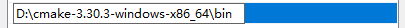
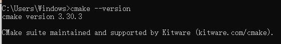
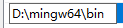
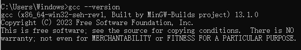
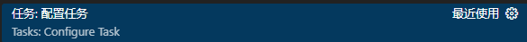

# 1-环境配置

### 1 下载安装cmake

* 下载地址：[Download CMake](https://cmake.org/download/)
* 解压下载的cmake压缩包
* 配置环境变量

  ​​
* 验证环境

  ​​

### 2 安装MinGW

* 下载地址：https://github.com/niXman/mingw-builds-binaries/releases/download/13.1.0-rt_v11-rev1/x86_64-13.1.0-release-win32-seh-ucrt-rt_v11-rev1.7z
* 解压下载的压缩包
* 配置环境变量

  ​​
* 验证环境

  ​​

### 2 安装 vs code插件

* C/C++
* Cmake
* CmakeTools

### 3 vscode 配置文件

* c\_cpp\_properties.json：用于编辑器正确跳转，高亮，宏开关正常显示等作用

  ​​

* settings.xml：提供该工程VSCode基本配置，以及各插件的配置

  ​​

* tasks.json：为Run tasks命令增加自定义的可选待执行任务

  ​​
* launch.json：调试配置

  ‍
