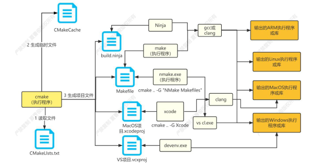
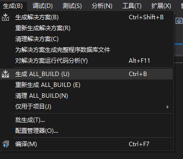
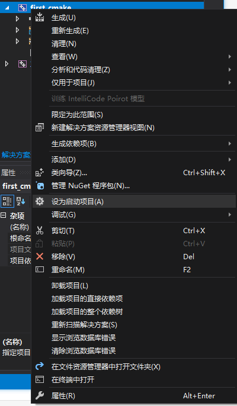
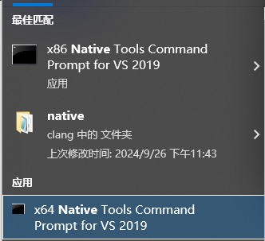

# chapter-1-cmake快速入门

### 1 cmake基本概念

##### 1 什么是cmake

	cmake适用于**构建**、**测试**和**软件打包**的开源跨平台工具

##### 2 为什么选用camke

* 避免硬编码路径
* 持续集成：

  * 每次继承都通过自动化的制造（提交、发布、自动化）来验证，准确的发现集成错误
  * 完成更新，集成到主干，快速发现、定位错误
  * 不同的更新主干，不经常集成，会导致集成成本变大
  * 自动化测试
* 支持不同操作系统（交叉编译）
* 支持多个编译器
* 单元测试

**cnake特性：**

* 自动搜索需要的程序、库文件和头文件
* 独立的构建目录，可以安全清理
* 创建复杂的自定义命令
* 配置时选择可选组件的能力
* 在静态库和共享构件之间轻松切换
* 大多数平台自动生成文件依赖项并支持并行构建

##### 3 cmake工作原理

​​

### 2 cmake安装

##### 1 **Linux**

* 直接安装

```undefined
apt install cmake
```

* 源码编译安装

```undefined
apt install g++
apt install make
apt install ninja-build
apt install unzip
apt install libssl-dev

cd camke
./configure
make -j32
make install

vi~/.bash_profile
export PATH=/usr/local/share/cmake$PATH

cmake --version
```

##### 2 Windows

* 直接安装

  * 下载：https://github.com/Kitware/CMake/releases/download/v3.30.4/cmake-3.30.4.zip
  * 配置环境变量
* 编译安装

  * 下载

    https://github.com/Kitware/CMake/releases/download/v3.31.0-rc1/cmake-3.31.0-rc1.zip
  * 编译源码安装

    ```undefined
    # -S cmakelists文件位置 -B build位置
    cmake -S . -B build
    # Windows下默认Debug形式编译
    cmake --build build
    cmake --build build --config Release
    # Windows下需要切换到管理员
    cmake --install build
    ```

* 配置环境变量

### 3 cmake实例

```c++
#include <iostream>

using namespace std;

int main() {
	cout << "first cmake" << endl;
	// 避免执行exe cmd 窗口闪退
	system("pause");
	return 0;
}
```

```cmake
# 指定cnake最低版本
cmake_minimum_required(VERSION 3.20)

# 构建项目名称
project(first_cmake)

# 构建可执行程序
add_executable(first_cmake first_cmake.cpp)
```

##### 1 Windows

```cmake
cmake -S . -B build
```

* visual studio

  * 打开first\_cmake.vcxproj
  * 点击生成

    ​​
  * 设置启动项目

    ​​
* cmake

  * cmake --build build
  * 执行exe文件
* nmake

  ​​

  ```cmake
  # -G 指定vs版本
  cmake -S . -B n -G "NMake Makefiles"
  cmake --build n
  ```

##### 2 Linux

```cmake
cmake -S . -B build
cmake --build build
```

### 4 动态库与静态库

##### 1 静态库

* 文件名

  * Windows .lib

    * Debug：字符源码
    * Release：二进制源码
  * Linux lib.a
* 注意：当编译静态库时，例如A部分调用了静态线程库，而A调用的B部分调用了动态的线程库，这时回导致编译不过，而动态库则不会存在这个问题（静态库将所有代码复制进来，而动态库只需要接口地址）
* 示例

  ```cmake
  //xlog.h
  //放置在当前cpp中重复导入
  #ifndef XLOG_H
  #define XLOG_H
  class Xlog{
  public:
  	Xlog();
  };
  #endif

  ```

  ```cmake
  #include "xlog.h"
  #include <iostream>

  using namespace std;

  Xlog::Xlog(){
       cout<<"Create Xlog"<<endl;
   }

  ```

  ```cmake
  cmake_minimum_required(VERSION 3.20)

  project(xlog)

  add_library(xlog STATIC xlog.cpp xlog.h)

  ```

  ```cmake
  cmake_minimum_required(VERSION 3.20)
  project(test_xlog)
  # 指定头文件查找路径
  include_directories(../xlog)
  # 指定库查找路径
  link_directories(../xlog/build)

  add_executable(test_xlog test_xlog.cpp)
  # 指定加载的库
  target_link_libraries(test_xlog xlog)

  ```

  ```cmake
  #include <iostream>
  #include "xlog.h"

  using namespace std;

  int main(){
  	Xlog xlog;
  	cout<<"test xlog"<<endl;
  	return 0;
  }

  ```

  ‍

##### 2 动态库

* 文件名

  * Windows .dll
  * Linux lib.so

##### 3 头文件作用

	静态库‌在编译时直接整合到目标程序中，这意味着静态库中的**代码会被完整地复制到最终的可执行文件中**。因此，使用静态库编译的程序不依赖于外部库文件，可以在没有安装这些库的机器上独立运行‌。既然如此，**为什么还需要头文件？**

	<span data-type="text" style="background-color: var(--b3-font-background1);">头文件</span>**提供了库中函数的声明** **，允许开发者在其他代码文件中调用这些函数**，而无需关注函数实现的细节。‌

	静态库是编译后的二进制文件，包含了**库函数的实际实现代码**。然而，当其他开发者想要使用这些库函数时，需要知道**这些函数的接口信息，包括函数名、参数类型、返回值类型等，以便正确地调用这些函数**。这些接口信息就是通过头文件（.h文件）提供的。

##### 4 补充

* 静态库在程序编译时会被连接到目标代码中，程序(exe)运行时将不再需要该静态库。（如果exe引用的只有静态库，可以直接将exe拷贝给客户使用。）
* 动态库在程序编译时并不会被链接到目标代码中，而是在程序运行时才和可执行程序一起被载入内存，因此在可执行程序(exe)运行时还需要动态库同时存在。（如果exe引用的有动态库，将exe拷贝给客户使用的时候，必须要给动态库一起拷贝过去。不然exe无法正常打开使用）
* 无论是静态链接库还是动态链接库，最后都有lib文件，

  * 静态库对应的lib文件叫静态库
  * 动态库对应的lib文件叫**导入库**。

    实际上静态库本身就包含了实际执行代码、符号表等，而对于导入库而言，其实际的执行代码位于动态库中，导入库只包含了地址符号表等，确保程序找到对应函数的一些基本地址信息。
